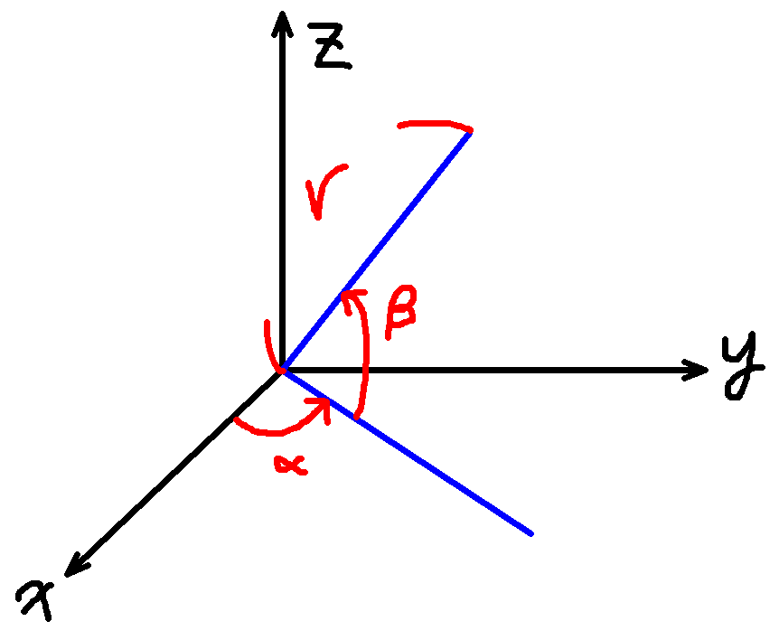
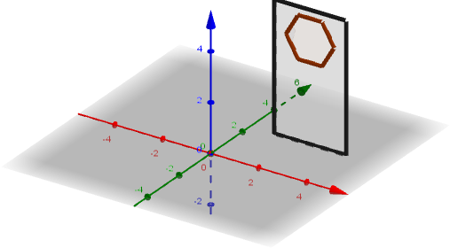

# Power Cell Detector Using CV2 & TensorFlow

## Environment Requirement

Packages

- python (Don't install the latest)
- numpy (Don't install the latest)
- cv2
- tensorflow

Run setup using

- `python3 -m pip install --upgrade pip`
- `pip3 install --upgrade setuptools`
- `pip3 install numpy`
- `pip3 install opencv-python`
- `pip3 install tensorflow`

For oneline *paste and use*

`python -m pip install --upgrade pip setuptools; pip install numpy==1.18.5 opencv-python tensorflow`

## Setup issues

- `ImportError: libGL.so.1: cannot open shared object file: No such file or directory`

This is an opencv issue, run `sudo apt install libgl1-mesa-glx`

- `Illegal instruction (core dumped)`

This is a tensorflow issue, you should try downgrading python

Usually tensorflow does not support the latest version

You can also try `virtualenv` ([Click Me](#how-to-use-`pyenv`-+-`virtualenv`))

You can try download *.whl file from [Here (Chinese)](https://www.tensorflow.org/install/pip?hl=zh-tw)

If your CPU is old (doesn't support AVX), you can try `pip3 install tensorflow==1.5`

- `tensorflow 2.3.0 requires numpy<1.19.0,>=1.16.0, but you'll have numpy 1.19.0 which is incompatible.`

Try downgrading numpy : `pip3 install numpy==1.18.5` ([Click Me](#extra-links-you-might-not-be-interested-in))

## Rectangular Coordinates & Spherical Coordinates

`(x, y, z)` <==> `(r, a, b)`

(`a` means alpha, `b` means beta, they are in `rad`)

The wall is parallel to xz plane

## How To Use `pyenv` + `virtualenv`

Useful Link : [Click Me (Chinese)](https://medium.com/python4u/python-virtualenv%E8%99%9B%E6%93%AC%E7%92%B0%E5%A2%83%E5%AE%89%E8%A3%9D-9d6be2d45db9)
,
[For Ubuntu (Chinese)](https://www.itread01.com/content/1547720824.html)

Install `pyenv` : `curl -L https://github.com/pyenv/pyenv-installer/raw/master/bin/pyenv-installer | bash`

List Available Python Versions : `pyenv install --list`

Install Other Python Version : `pyenv install 3.6.10`

Create Virtual Environment : `pyenv virtualenv 3.6.10 venv36`

Start Virtual Environment : `pyenv activate venv36`

Exit Environment : `source deactivate`

## Extra Links You Might Not Be Interested In

Available tensorflow versions can be found here : https://pypi.org/project/tensorflow/2.2.0/#history

Available numpy versions can be found here : https://pypi.org/project/numpy/#history